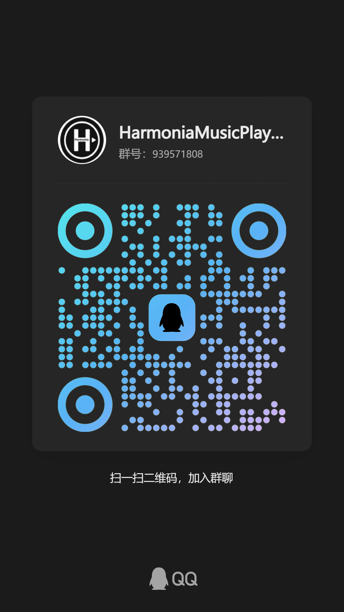

<div align="center">

# 🎵 Harmonia Music Player

<!-- Language Switch / 语言切换 -->
[**中文**](./README.md) | [**English**](./README_EN.md)

[](https://github.com/beststoryilove/Harmonia-MusicPlayer)

<br/>

*🎶 Make music at your fingertips.*

---

</div>

## 📖 Introduction

**Harmonia** is a browser-based online music player. Inspired by the design language of **Apple Music** and the interaction aesthetics of **iOS**, it is dedicated to providing a smooth, elegant, and feature-rich music playback experience on the web.

The project is built with a pure front-end tech stack (HTML / CSS / Vanilla JS) and runs without any backend service. Music data comes from **NetEase Cloud Music** and **KuGou Music**, with word-by-word lyrics rendering powered by [AMLL](https://github.com/amll-dev/applemusic-like-lyrics).

> ✨ **Core Philosophy**: Simplicity, Elegance, Enjoyment — making every playback a delight.

---

## ✨ Features

### 🎵 Multi-Source Playback

<table>
  <tr>
    <td align="center"><b>NetEase Cloud</b></td>
    <td align="center"><b>KuGou</b></td>
  </tr>
  <tr>
    <td>Massive Chinese music library</td>
    <td>High-quality audio, VIP access</td>
  </tr>
</table>

- **Dual source** switching: NetEase Cloud & KuGou
- KuGou quality options: **128 MP3 / 320 MP3 / FLAC / Lossless**
- KuGou account login (QR code / phone), sync playlists & claim Concept VIP

### 🎤 Word-by-Word Lyrics (AML)

- **AMLL (Apple Music-like Lyrics)** engine with word-by-word filling animation
- Translation / Romanization toggle
- **TTML** advanced lyrics format support (duets, background vocals)
- Freely switch between Classic and AMLL modes
- Multiple animation modes: **Visual Priority / Performance Priority / Preview**

### 🏝️ Dynamic Island

- Inspired by Apple iPhone 14 Pro's Dynamic Island
- Collapsed state shows "Now Playing"; tap to expand the search panel
- Integrated search box, results, pagination, and error display
- Toast message support

### 📋 Playlists & Song Sheets

- **Playlist**: Add, remove, drag-to-reorder, batch management
- **Favorites**: One-tap to save favorite songs
- **History**: Auto-recorded, up to 50 tracks
- **My Playlists**: Create local playlists / Sync KuGou playlists
- A-Z sort, custom sort, source filter
- Context menu "Add to Playlist" (with touch long-press support)

### 🎨 Visual & Themes

- **Dark / Light** dual themes with one-tap switching
- Album art **3D tilt** effect (mouse-follow parallax)
- **Liquid Glass** frosted-glass UI aesthetic
- Dynamic background color based on album cover palette
- **Fluid animation** background layer
- Player layout: **Harmonia Classic / Apple Music** style toggleable

### 🎛️ Audio Equalizer

- **10-band EQ** (31Hz ~ 16kHz)
- **13 built-in presets**: Flat, Warm, Bass Boost, Deep Bass, Vocal, Podcast, Bright, Electronic, Rock, Classical, Jazz, Acoustic, Dance
- Custom Preamp gain (±12dB)
- Real-time processing via **Web Audio API**

### 🔗 Sharing & Export

- **Share Card**: Generate beautiful posters (1080×1920), copy to clipboard or download
- **Mini Player**: PiP (Picture-in-Picture) window for desktop floating playback
- **Desktop Lyrics**: Via PiP or WebSocket connection
- **Save Album Art**: One-tap download of current cover

### 🌐 AI Translation (Experimental)

- Integrated **GLM-4.7-Flash** AI translation
- Two modes: "Translate foreign songs only" / "Translate all foreign songs"
- Auto-translate lyrics to Chinese with line-by-line comparison

### ⌨️ Keyboard Shortcuts

| Key | Action |
|-----|--------|
| `Space` | Play / Pause |
| `← / →` | Previous / Next track |
| `↑ / ↓` | Volume ±5% |
| `L` | Toggle lyrics |
| `T` | Toggle theme |
| `S` | Focus search |
| `M` | Open / Close sidebar |
| `R` | Cycle play mode |
| `P` | Share card |
| `D` | Mini player |
| `Tab` | Expand / Collapse Dynamic Island |
| `?` | Shortcuts list |
| `Esc` | Close modal |

### 📱 Responsive Design

- Fully responsive across **desktop / tablet / phone**
- Mobile-exclusive fullscreen lyrics mode
- Touch drag-sort, long-press context menu
- Smart degradation (disables heavy blur on mobile for battery saving)

---

## 🏗️ Architecture

```
Harmonia/
├── main.html              # Main page (all DOM & modals)
├── css/
│   ├── variables.css      # CSS variables / font definitions
│   ├── base.css           # Global styles / Dynamic Island / common components
│   ├── layout.css         # Main layout
│   ├── sidebar.css        # Sidebar / playlists
│   ├── search.css         # Search panel styles
│   ├── player.css         # Player controls / lyrics styles
│   ├── settings.css       # Settings panel
│   ├── lyrics.css         # Lyrics enhancement animations
│   ├── share.css          # Share card modal
│   └── responsive.css     # Responsive adaptations
├── js/
│   ├── main.js            # Main logic (~9300 lines)
│   │   ├── Dynamic Island control
│   │   ├── Play / pause / track switching
│   │   ├── Search / pagination
│   │   ├── Lyrics parsing & rendering (AMLL + Classic)
│   │   ├── Playlist CRUD
│   │   ├── KuGou API / VIP
│   │   ├── Equalizer (Web Audio)
│   │   ├── PiP (Picture-in-Picture)
│   │   ├── Share card generation
│   │   ├── Theme / settings persistence
│   │   └── Keyboard shortcuts / initialization
│   └── MODULES.md         # Module documentation
└── fonts/
    ├── PingFangSC-Regular.woff2
    ├── PingFangSC-Semibold.woff2
    ├── sf-pro-display_regular.woff2
    └── sf-pro-display_semibold.woff2
```

### Tech Stack

| Category | Technology |
|----------|------------|
| **Markup** | HTML5 |
| **Styles** | CSS3 (Liquid Glass, Flexbox, Grid, Animation, Backdrop Filter) |
| **Script** | Vanilla JavaScript (ES6+) / Zero dependencies |
| **Lyrics Engine** | [@applemusic-like-lyrics/core](https://github.com/amll-dev/applemusic-like-lyrics) (ESM) |
| **Audio Processing** | Web Audio API (10-band EQ) |
| **Desktop Extension** | Picture-in-Picture API / WebSocket |
| **Icons** | [Font Awesome 6.4](https://fontawesome.com/) |
| **Fonts** | Apple PingFang / SF Pro |

---

## 🤖 AI Models Used

> During the development of Harmonia, the following AI models provided significant assistance in code writing, architecture design, and feature implementation.

AI models used in this project (sorted A-Z):

- **ChatGPT** (including GPT4.5, GPT5, GPT5.1-5.5)
- **Deepseek** (including R1, V3, V3.1, V3.2, V3.2 speciale, V4)
- **Gemini** (including 3.0Pro, 3.1Pro)
- **Grok** (including v4.1-4.3)
- **Qwen** (including v3.5-v3.6 full series)
- **阶跃星辰 / StepFun** (including step-3.7-flash)
- **LongCat** (including LongCat-2.0)

---

## 💬 Community & Communication

We welcome all users to join our community, report issues, share playlists, or suggest improvements!

| Channel | Link |
|---------|------|
| 🌐 **Official Blog** | [azalkmin.abrdns.com](https://azalkmin.abrdns.com) |
| 💬 **QQ Group** | [Click to join](https://qm.qq.com/q/p4WYBXFGNO) |
| 📱 **QR Code** |  |

---

## 🙏 Acknowledgements

During the development of Harmonia, we received help from many open-source projects, APIs, and resources. Our sincere gratitude goes to:

| Project / Resource | Usage |
|--------------------|-------|
| [GD 音乐台开发者 API](https://music-api.gdstudio.xyz) | Music API provider |
| [酷狗音乐 API](https://github.com/MakcRe/KuGouMusicApi) | KuGou Music API provider (Vercel deployment) |
| Apple **PingFang** / **SF Pro** | Font resources |
| [Font Awesome](https://fontawesome.com/) | Icon library |
| [Apple Music](https://music.apple.com/) & [iOS](https://www.apple.com/ios/) | Design inspiration |
| [mengobs/musicplayer](https://github.com/mengobs/musicplayer) | Lyrics display reference |
| [AMLL (Apple Music-like Lyrics)](https://github.com/amll-dev/applemusic-like-lyrics) | Word-by-word lyrics engine |

---

## Star History

<a href="https://www.star-history.com/?repos=beststoryilove%2FHarmonia-MusicPlayer&type=date&legend=top-left">
 <picture>
   <source media="(prefers-color-scheme: dark)" srcset="https://api.star-history.com/chart?repos=beststoryilove/Harmonia-MusicPlayer&type=date&theme=dark&legend=top-left&sealed_token=Z-FADy6CBKLhFfn4bqCt3NCY-4rkjaWi_OgYDpRrE0vTODPxxSBrt7Xx5Eun2dH86OHh3bs86B4uhwij3X7qHHrz-I98WaFp0JO2wciXWKAnc35HhYPyIH-dVqKyKEFp4LnGvPL4CzG9kl5E7LTvGIbaPs1EpofWYpr3MSqt3NG-tuXrmIDdt1A5khTf" />
   <source media="(prefers-color-scheme: light)" srcset="https://api.star-history.com/chart?repos=beststoryilove/Harmonia-MusicPlayer&type=date&legend=top-left&sealed_token=Z-FADy6CBKLhFfn4bqCt3NCY-4rkjaWi_OgYDpRrE0vTODPxxSBrt7Xx5Eun2dH86OHh3bs86B4uhwij3X7qHHrz-I98WaFp0JO2wciXWKAnc35HhYPyIH-dVqKyKEFp4LnGvPL4CzG9kl5E7LTvGIbaPs1EpofWYpr3MSqt3NG-tuXrmIDdt1A5khTf" />
   
 </picture>
</a>

---

<div align="center">

🌟 **If Harmonia brings you the joy of music, we'd love a Star!** 🌟

<sub>Built with ❤️ and AI · Make music at your fingertips</sub>

</div>

